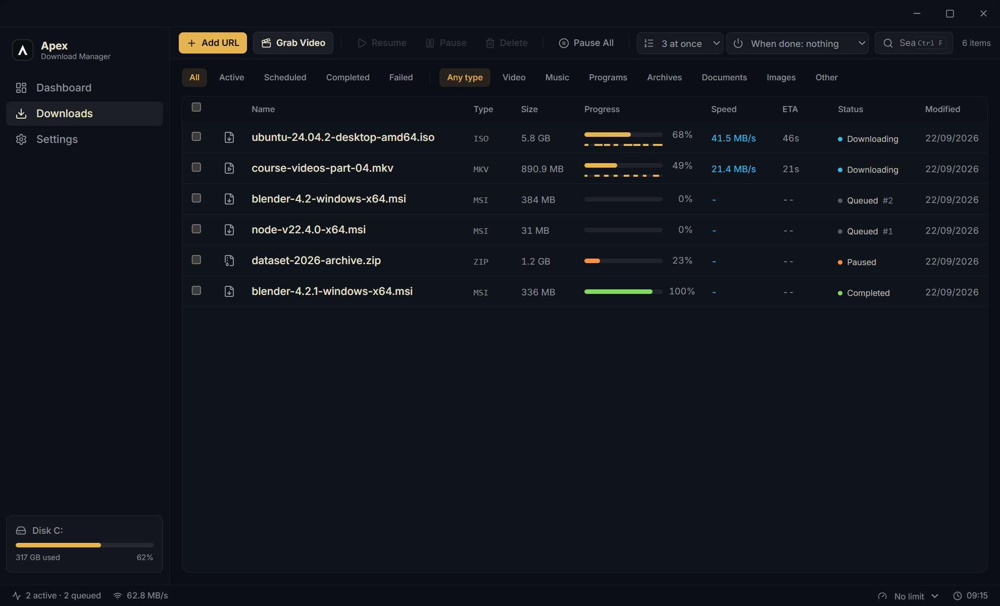
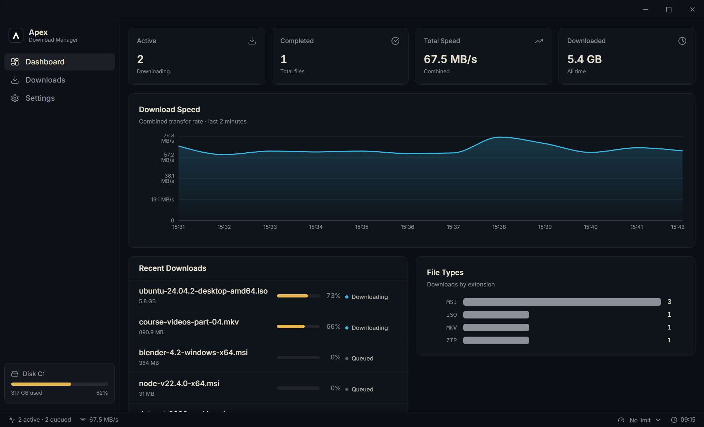
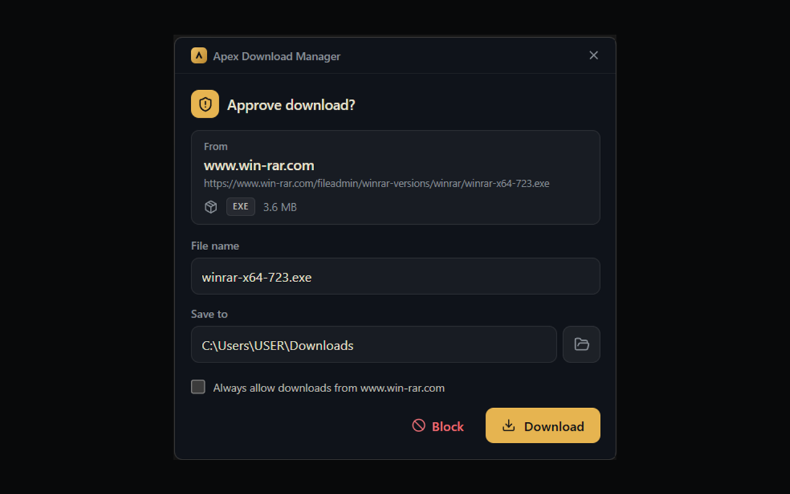

# Apex Download Manager

**Download faster. Smarter. Safer.**

Apex is a lightweight, modern download manager for Windows. A native Rust engine
splits every download across up to 32 parallel connections, survives pauses,
restarts, and network drops - wrapped in a clean, minimal desktop UI.

> ⚡ Single native binary (Tauri v2 + Rust). No Electron, no JVM, no bloat.

**[Download for Windows](https://apex-download-manager.vercel.app/dl)** · also on
[Chrome](https://chromewebstore.google.com/detail/apex-download-manager/gopdilekdjnfekbmhedjidlmaahnnhco),
[Edge](https://microsoftedge.microsoft.com/addons/detail/apex-download-manager/bjpggfmgbhafacbcmhpncjaapdknohjg) and
[Firefox](https://addons.mozilla.org/en-US/firefox/addon/apex-download-manager/) for browser capture ·
[Website](https://apex-download-manager.vercel.app/)



<table>
  <tr>
    <td width="50%"></td>
    <td width="50%"></td>
  </tr>
  <tr>
    <td align="center">Live speed and totals</td>
    <td align="center">Downloads from your browser, approved in one click</td>
  </tr>
</table>

---

## Features

**Engine**
- Multi-connection segmented downloads (up to 32 parallel streams per file)
- Pause / resume that survives app restarts - per-segment progress is persisted
- Resume integrity: `ETag`/`If-Range` validation prevents silently corrupted files
- Automatic retry with backoff on stalls and dropped connections
- Download queue with a concurrency limit and global speed limiting
- Per-download speed caps, adjustable live while the download runs
- Proxy support (HTTP / HTTPS / SOCKS5, with authentication)
- Scheduling: start any download at a chosen time, sleep/shut down when the queue finishes
- Video grabber: yt-dlp integration with quality picker, playlists, and
  one-click tool install (ffmpeg merging for highest resolutions)

**Capture**
- Browser extension (Chrome / Edge / Brave / Firefox) that hands downloads to
  Apex - and safely falls back to the browser when Apex isn't running
- Cookie/referer handoff so downloads behind logins just work
- Clipboard watcher: copy a download link anywhere, get a one-click toast
- Drag & drop URLs onto the window, batch-add multiple URLs at once

**Safety**
- Every completed file is tagged with Mark-of-the-Web so Windows SmartScreen
  and Defender scan it like a browser download
- Built-in SHA-256 checksum verification against publisher-provided hashes
- The extension requests **zero website permissions** - it cannot read your pages
- Local-only: no accounts, no telemetry, nothing leaves your machine

**Interface**
- Minimal dark UI: dashboard with live speed chart, filterable download list,
  per-download properties panel with live segment view
- Keyboard-first: `Ctrl+N` new download, `Ctrl+F` search, `Space` pause/resume,
  `Del` delete, `Enter` open
- System tray: close the window, keep downloading

## Project layout

```
apex-download-manager/
├── desktop-ui/            # Tauri v2 app
│   ├── src/               # React 19 + TypeScript + Tailwind v4 frontend
│   └── src-tauri/         # Rust: download engine, SQLite, capture server
├── browser-extension/     # Chrome MV3 extension (capture + context menu)
└── website/               # Landing page (static, self-contained)
```

## Building from source

Prerequisites: [Rust](https://rustup.rs) (stable, MSVC toolchain),
[Node.js](https://nodejs.org) ≥ 20, and the Visual Studio Build Tools
(C++ workload + Windows SDK).

```powershell
cd desktop-ui
npm install
npm run tauri dev      # development
npm run tauri build    # produces MSI / NSIS installers
```

### Browser extension

1. Open `chrome://extensions`, enable **Developer mode**, click **Load unpacked**,
   select the `browser-extension/` folder.
2. In Apex: **Settings → Browser Integration**, copy the pairing token.
3. Click the extension icon, paste the token, **Save** - the status dot turns green.

## Architecture notes

- The engine probes each URL with a ranged request, plans segments, and writes
  all connections into one preallocated temp file (`.adm`), renamed on completion.
- State lives in SQLite (WAL) under `%APPDATA%/com.apex.download-manager/`.
- The extension talks to a token-gated HTTP endpoint bound to `127.0.0.1:43666`.
  Interception is cancel-then-hand-off: the browser download is cancelled
  immediately (before any Save As dialog), then handed to Apex - and restarted
  in the browser if Apex is unreachable or rejects it, so nothing is lost.

## Roadmap

- [x] Video grabber (yt-dlp integration)
- [x] Cookie handoff for authenticated downloads
- [x] Proxy support
- [x] Firefox extension
- [x] Auto-updates (GitHub Releases)
- [x] Dynamic segment re-splitting (finished connections take over the tail of slow ones)
- [ ] Code signing
- [x] Extension store publishing (Chrome Web Store / Edge Add-ons / AMO)
- [x] Bandwidth scheduler (off-peak speed profiles)

## License

Copyright © 2026 ThembaTman0.

Apex Download Manager is free software: you can redistribute it and/or modify
it under the terms of the GNU General Public License as published by the Free
Software Foundation, either version 3 of the License, or (at your option) any
later version. See [LICENSE](LICENSE) for the full text.

It is distributed in the hope that it will be useful, but WITHOUT ANY WARRANTY;
without even the implied warranty of MERCHANTABILITY or FITNESS FOR A
PARTICULAR PURPOSE.
